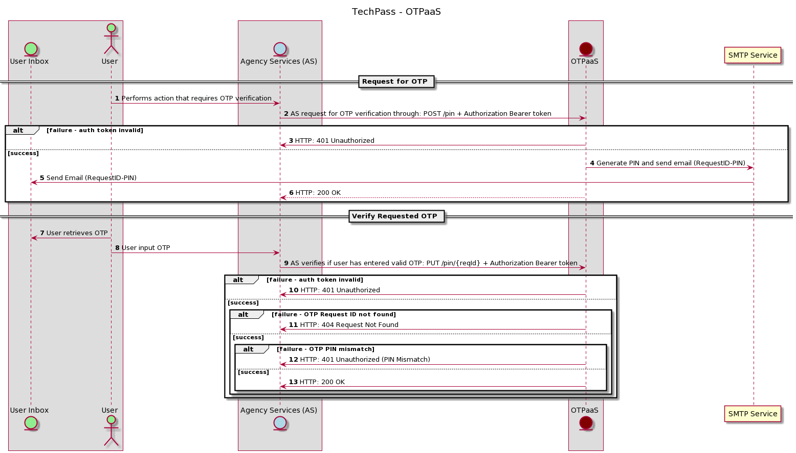

# OTPaaS

## Overview
OTPaaS (abbreviation for OTP-as-a-Service) is a TechPass service that allow onboarded tenant services to perform a quick verification of a particular user. TechPass OTPaaS verify end users by sending an OTP to the user's email address for verification.

?> *Currently OTPaaS only allow verification to `gov.sg` users.*

## Getting started

To get started, contact the TechPass team to onboard OTPaaS.

## Properties

### App ID
The `appId` that will uniquely identify your OTP credentials.

### Namespace
The tenant `namespace` that you belong to within TechPass. This is to isolate your OTP credentials apart from other tenants in TechPass.

### Secret
The `secret` key that is used to construct the hash to be used as the API Key when you call OTPaaS APIs.

### Service Name
The `serviceName` is applied to the email that will be sent out by TechPass to the end user to identify what app service they are performing the verification to.

## OTPaaS Workflow
The OTPaaS requires your service to make authorize calls by using your API Key. As the API Key is considered sensitive credentials, you must have a backend to send the request(s) to TechPass OTPaaS.

### Sequence Diagram
The sequence diagram below illustrates a typical use-case for the OTPaaS.


### Splitting the OTP input
Take note that the user will be receiving their OTP in the form of `id-pin` e.g. `cAfpFbxX-740767`.

Your code will likely need to split the input by separating the `id` and `pin` using the `-` delimiter. That should aid in calling the verify OTP API as you will need the `id`, which can either be retrieve from the response of the request OTP API, or by spltting the OTP input that the user entered.

## How to call OTPaaS APIs
For the API Documentation, please refer to [TechPass OTPaaS API documentation](https://stg.docs.developer.gov.sg/docs/techpass-otpaas-api/).

OTPaaS contains 2 API endpoints:
1. POST  /otp
2. PUT   /otp/{id}

The first endpoint generates an OTP to the end user and sends it to their email.

The second endpoint verifies the OTP against the ID of the OTP request.

### Generating your API Key
The API requests require the Authorization Bearer header together with the valid token to allow a successful call. The token is a base64 encoded string hash of the `appId` and the HMAC-SHA256 hash `secret`.

You may use the following Node.js code to compute your API Key. Replace your `appId` and `secret` in the appropriate const below.

```javascript
const crypto = require('crypto');
const app_id = "";
const app_secret = "";

const secret = crypto.createHmac('sha256', app_secret)
                    .update(app_id)
                    .digest('hex');
const token = Buffer.from(`${app_id}:${secret}`).toString('base64');

const auth_string = `Bearer ${token}`;

console.log(auth_string);
```

The output will be a Authorization Bearer token that will be your API Key to call TechPass OTPaaS.